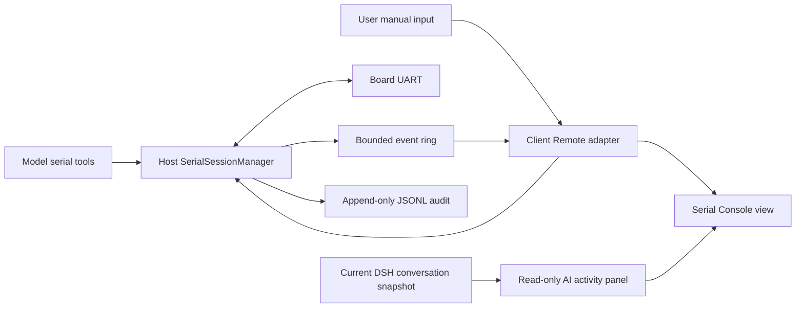

# Architecture

## 目标

这个插件不是“给模型一个任意 Shell”，而是提供一个串口领域能力：端口发现、单会话连接、发送、读取、模式等待、证据保存和人机共享预览。相同核心可用于 U-Boot、Linux console、MCU shell、AT 命令和裸二进制协议。

## 数据路径

Host 是唯一物理串口所有者。模型工具调用同进程 service；Web Client 经 Remote 调用连接、发送和增量快照。所有 RX、TX、状态、错误和 marker 进入同一带序号事件流。

## 包边界

### Shared protocol

`src/protocol.ts` 只包含可 JSON 表达的值。二进制跨边界使用 Base64；Host 内部仍使用 `Uint8Array`。

### Serial core

`SerialSessionManager` 不依赖 DeepSeek Harness。它依赖 `SerialTransportFactory`，因此测试不需要真实串口。当前实现管理一个物理端口；多板卡应新增 `SerialSessionRegistry`，而不是让一个 Manager 同时承担多个设备。

### Node transport

`NodeSerialPortFactory` 是 `serialport` npm 包的唯一适配层。未来可增加 TCP serial server、ADB console 或测试回放 transport，但它们必须保持同一事件语义。

### Client store and view

`SerialConsoleStore` 依赖 `SerialConsoleRemote` 接口，不依赖 Harness Context。DSH Client 插件只负责把生成的 `ctx.remote.serialConsole` 适配成这个接口并注册 UI slot。Store 保留连接选择、增量事件窗口和单一写 FIFO，不解析 readline 或维护浏览器草稿。

DSH 适配层同时使用 `conversation.view` 的公开 session standard kit，把当前会话的流式 assistant、运行中工具、最终回复和错误折叠成只读 AI 活动快照。正文和思考复用 `@deepseek-ai/dsh-client-ui-primitives` 的流式 `MarkdownText`，保持与原生 Chat 一致的非可信 Markdown 安全边界和代码块体验。该浏览窗不复制会话输入、审批或完整 Chat renderer，也不增加 Host/Remote 接口；独立 React 控制台未提供 `useConversation` 时仍只渲染串口。面板宽度和开关只保存为浏览器本地偏好，不持久化任何会话正文。

`XtermSerialTerminal` 是 Text 模式唯一的屏幕与输入面。RX 的 Base64 原始字节作为 `Uint8Array` 写入 xterm；TX 不写入屏幕，避免板端回显与浏览器本地回显重复。Tab、Backspace、方向键、粘贴、IME 和控制序列按 xterm 产生的字节发送，补全和光标位置由板端 readline 与 VT 回显决定。

每个浏览器 Store generation 在内存中保留一个 xterm Serialize 检查点。检查点包含终端内容与模式、尺寸、事件序号、gutter marker、待归属提交和 RX 尾部关联状态。视图重挂时先在相同尺寸的未打开终端中恢复，再只消费检查点后的连续事件；恢复完成前隐藏中间帧并禁用输入。会话变化、清屏、事件回退、序号缺口、ring 截断或签名校验失败都会丢弃检查点并安全回退到完整事件重放；替代缓冲区处于活动状态时不创建新检查点。检查点不写入磁盘，也不替代 Host ring 或 JSONL 审计。

xterm 选区主题同时设置 `selectionBackground` 与 `selectionForeground`，使用终端前景/背景反色；失焦选区仅降低背景亮度。结构样式保留官方 `.xterm-decoration-top` 层级，让反色后的选中文字绘制在 selection overlay 上方，避免背景覆盖层把字形遮成实心块。

来源 gutter 位于终端字节流之外。活动的最底部逻辑行始终隐藏标签；RX 形成的历史行默认标记 `B`，state/marker/error 标记 `S`。TX 侧只跟踪是否提交了可见命令，空回车不建立用户归属。提交后仅在 xterm 已完成且尚未归属的行中按完整行文本或命令尾部精确匹配；每个完成行最多消费一个待匹配提交，避免快速重复命令错位。匹配成功才把 `B` 升级为 `U` 或 `M`，无法证明来源时保持 `B`。物理 Enter 由 xterm `onData` 的单一路径映射为所选 CR/LF/CRLF，避免按键处理器与数据事件重复发送。组件挂载时记录已有事件序号上界；xterm 应用该范围内的历史 RX 时禁止 `onData` 回写，防止 DSR/DA 等终端查询在视图切换后再次生成 `CSI row;column R` 等响应。新到达的实时 RX 查询仍允许正常终端响应。事件 actor 和原始 JSONL 始终是审计权威，gutter 的历史行关联属于展示信息。

## 事件语义

当前 v0 协议包含：

- `rx`：板卡到 Host 的原始 bytes 与可选 UTF-8 派生文本。
- `tx`：Host 已完成的写入，包含 `actor=model|user` 和可选 `toolCallId`。
- `state`：opening、connected、closing、disconnected、error。
- `marker`：用户或模型标记证据位置。
- `error`：连接和 transport 错误。

`seq` 在 Manager 进程生命周期内严格递增。每次显式 `connect` 创建新的 `sessionId` 并清空内存 ring；旧 JSONL 文件不删除。

下一版应增加：

- `schemaVersion`；
- `connectionEpoch`，用于一个逻辑 session 内的自动重连；
- `writeId` 与 queued/started/committed/failed 阶段；
- `byteLength`；
- expect started/matched/timeout/cancelled 事件；
- ring 的最大事件数和最大字节数双上限。

## 写入与取消

当前实现通过 Promise tail 严格串行化模型和用户写入。下一版应改成显式有界队列：

- 未开始写入的请求可以确定性取消；
- 已开始写入后断线或取消返回 `WRITE_AMBIGUOUS`；
- 断线时失败所有排队写入；
- 从不自动重放写入；
- 每次写入设置最大字节数和队列长度。

## Expect

`waitForText` 只消费 RX 文本，支持跨 transport chunk 匹配、窗口上限、超时和 `AbortSignal`。默认工具行为应从“现在”开始，而不是从整个历史 ring 开始，避免旧的 `login:` 或 shell prompt 造成误匹配。

下一版还应支持 raw byte 子序列，并拒绝或规范化有状态正则 flags。

## Harness UI slot 决策

当前 Harness 的顶层 `details` 是 single slot，`ui-conversation` 已注册 DetailsPanel，并在内部声明 `conversation.details.tool`。第三方插件注册顶层 `details` 会替换现有详情栏，不能作为社区插件默认行为。

v0.1 注册 additive `conversation.view`，提供 `Serial` 标签页，并在标签页内部加入可折叠、可缩放的只读 AI 浏览窗。它直接消费该 slot 已注入的当前会话快照，因此不占用顶层 `details`，也不依赖尚未稳定的 shell overlay 扩展点。未来如果上游提供 additive details region，可把同一浏览组件迁入官方区域，而不改变串口数据链路。

## Remote 与实时性

Typert Remote 使用可取消的 unary 请求。`snapshot()` 保留立即读取语义，供模型工具、能力探测、backlog 排空和旧客户端使用；新 Host 的快照通过可选的 `capabilities.waitSnapshot = 'v1'` 声明等待能力。`waitSnapshot()` 在没有新事件时等待，默认 750 ms、最大 1000 ms；`waitMs = 0` 立即返回，但 Store 会按兼容轮询间隔调度下一次请求，避免高速空转。Host 在订阅前后各读取一次 ring，避免事件恰好出现在首次读取与监听器注册之间。

Store 在挂载期间持续保持一个 snapshot 请求。正常情况下使用 `waitSnapshot()`，RX、TX、state、error 或 marker 会立即唤醒请求；返回窗口尚未追平 `nextSeq` 或发生 `truncated` 时，改用 `snapshot()` 串行排空 backlog。每个请求都有独立 `AbortController` 和 1500 ms 保护超时。connect、disconnect、stop 和 Remote 卸载会取消旧请求，旧 generation 的结果不能更新当前状态，新请求必须等旧请求真正结算后才能发出。

每个 Store generation 先调用普通 `snapshot()`：能力标记缺失时直接切换为 150 ms 兼容轮询，标记存在时才调用 `waitSnapshot()`。当前 Gateway 会把多类 Host 和 carrier 错误统一包装成 `internal`，Store 不从错误文字猜测原因。长轮询收到 opaque `internal` 后会用普通快照诊断；连续两次出现“普通快照成功且仍声明等待能力”才停止当前 generation 的自动同步。普通快照也失败时仍按 100、200、400、500 ms 退避。官方 Client API 直接拒绝 Promise 则属于本地装配失败，会立即熔断。熔断后保留只读操作和 disconnect，直到 Remote 重新挂载。

`snapshot()` 和 `waitSnapshot()` 的 Typert 描述都声明 carrier cancellation。前者不需要 Host 业务逻辑等待，但 Browser 仍可停止等待网络响应；后者把相同 signal 继续传入 `SerialSessionManager`，用于注销 listener 和 timer。Host ring 过期时返回 `truncated=true`，Client 替换本地窗口并显示缺口提示。

单包客户端同时 mount 又消费 `remote.serialConsole`。Cordis 对 `ctx.remote.<namespace>` 的访问按 fiber `inject` 门控（未声明会抛 `cannot get property "remote.serialConsole" without inject`），但 namespace 服务只有在本插件 apply 运行 `$mount` 后才会出现，写进 `inject` 会让 fiber 永久 PENDING。因此单包形态在 `$mount` 完成后用 Cordis 的免 inject 读取通道 `ctx.get('remote.serialConsole')` 取 namespace；拆成独立 mount 包（见 integration 蓝图）时应改用 inject 声明 `remote.serialConsole`。

## 模型上下文

浏览器可以显示完整当前窗口，模型不能自动接收所有 RX。推荐工具：

- `serial_list_ports`
- `serial_connect`
- `serial_send`
- `serial_read`
- `serial_expect`
- `serial_mark`
- `serial_disconnect`

`serial_read` 必须有事件/字节/行数上限；`serial_expect` 只返回匹配附近的有限证据。所有返回值使用结构化 JSON，供 Code Mode 直接消费。

## 审计

`JsonlSerialEventSink` 当前按 `sessionId` 写入 append-only 文件。发布前应增加：

- 文件头：插件版本、协议版本、设备 USB 身份、串口参数；
- required/best-effort 审计策略；
- hash chain 或最终 SHA-256；
- 有界 flush 策略；
- Host 侧安全下载 RPC；
- 日志目录权限、保留周期和敏感数据说明。
