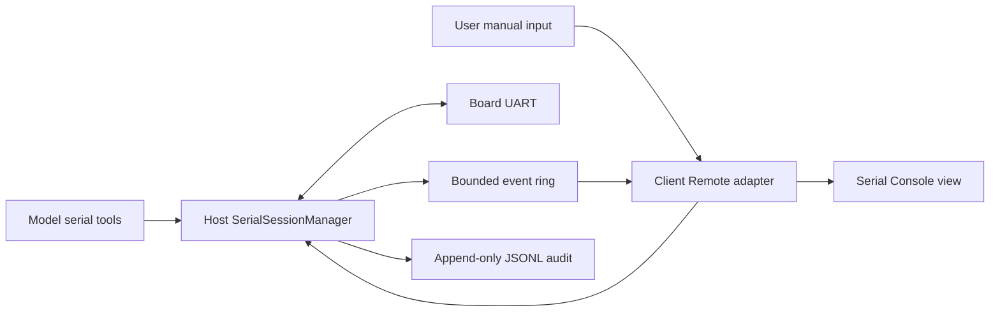

# Architecture

## 目标

这个插件不是“给模型一个任意 Shell”，而是提供一个串口领域能力：端口发现、单会话连接、发送、读取、模式等待、证据保存和人机共享预览。相同核心可用于 U-Boot、Linux console、MCU shell、AT 命令和裸二进制协议。

## 数据路径



Host 是唯一物理串口所有者。模型工具调用同进程 service；Web Client 经 Remote 调用连接、发送和增量快照。所有 RX、TX、状态、错误和 marker 进入同一带序号事件流。

## 包边界

### Shared protocol

`src/protocol.ts` 只包含可 JSON 表达的值。二进制跨边界使用 Base64；Host 内部仍使用 `Uint8Array`。

### Serial core

`SerialSessionManager` 不依赖 DeepSeek Harness。它依赖 `SerialTransportFactory`，因此测试不需要真实串口。当前实现管理一个物理端口；多板卡应新增 `SerialSessionRegistry`，而不是让一个 Manager 同时承担多个设备。

### Node transport

`NodeSerialPortFactory` 是 `serialport` npm 包的唯一适配层。未来可增加 TCP serial server、ADB console 或测试回放 transport，但它们必须保持同一事件语义。

### Client store and view

`SerialConsoleStore` 依赖 `SerialConsoleRemote` 接口，不依赖 Harness Context。DSH Client 插件只负责把生成的 `ctx.remote.serialConsole` 适配成这个接口并注册 UI slot。Store 保留连接选择、增量事件窗口和单一写 FIFO，不解析 readline 或维护浏览器草稿。

`XtermSerialTerminal` 是 Text 模式唯一的屏幕与输入面。RX 的 Base64 原始字节作为 `Uint8Array` 写入 xterm；TX 不写入屏幕，避免板端回显与浏览器本地回显重复。Tab、Backspace、方向键、粘贴、IME 和控制序列按 xterm 产生的字节发送，补全和光标位置由板端 readline 与 VT 回显决定。

来源 gutter 位于终端字节流之外。实时用户输入在发送前标记 `U`，模型 TX 与历史回放通过 TX 文本和附近 buffer 行关联为 `M`，普通 RX 标记 `B`，state/marker/error 标记 `S`。事件 actor 和原始 JSONL 始终是审计权威，gutter 的历史行关联属于展示信息。

## 事件语义

当前 v0 协议包含：

- `rx`：板卡到 Host 的原始 bytes 与可选 UTF-8 派生文本。
- `tx`：Host 已完成的写入，包含 `actor=model|user` 和可选 `toolCallId`。
- `state`：opening、connected、closing、disconnected、error。
- `marker`：用户或模型标记证据位置。
- `error`：连接和 transport 错误。

`seq` 在 Manager 进程生命周期内严格递增。每次显式 `connect` 创建新的 `sessionId` 并清空内存 ring；旧 JSONL 文件不删除。

下一版应增加：

- `schemaVersion`；
- `connectionEpoch`，用于一个逻辑 session 内的自动重连；
- `writeId` 与 queued/started/committed/failed 阶段；
- `byteLength`；
- expect started/matched/timeout/cancelled 事件；
- ring 的最大事件数和最大字节数双上限。

## 写入与取消

当前实现通过 Promise tail 严格串行化模型和用户写入。下一版应改成显式有界队列：

- 未开始写入的请求可以确定性取消；
- 已开始写入后断线或取消返回 `WRITE_AMBIGUOUS`；
- 断线时失败所有排队写入；
- 从不自动重放写入；
- 每次写入设置最大字节数和队列长度。

## Expect

`waitForText` 只消费 RX 文本，支持跨 transport chunk 匹配、窗口上限、超时和 `AbortSignal`。默认工具行为应从“现在”开始，而不是从整个历史 ring 开始，避免旧的 `login:` 或 shell prompt 造成误匹配。

下一版还应支持 raw byte 子序列，并拒绝或规范化有状态正则 flags。

## Harness UI slot 决策

当前 Harness 的顶层 `details` 是 single slot，`ui-conversation` 已注册 DetailsPanel，并在内部声明 `conversation.details.tool`。第三方插件注册顶层 `details` 会替换现有详情栏，不能作为社区插件默认行为。

采用两阶段方案：

1. v0.1：注册 additive `conversation.view`，提供 `Serial` 标签页，最容易随插件加载和卸载。
2. v0.2：注册 additive `shell.overlay`，实现右侧浮动/可缩放抽屉；通过 `sidebar.footer.action` 和串口工具卡控制开关。

如果未来上游提供 additive details region，再迁移到官方扩展点。

## Remote 与实时性

当前 Typert Remote 是 unary 请求/结果，不用于增量流。v0.1 使用：

```text
snapshot(afterSeq=N, limit=2000) every 150 ms
```

Host ring 过期时返回 `truncated=true`；Client 显示显眼缺口提示。这个轮询层可以日后无损替换为正式的增量协议，因为 UI store 只依赖 `SerialConsoleRemote`。

## 模型上下文

浏览器可以显示完整当前窗口，模型不能自动接收所有 RX。推荐工具：

- `serial_list_ports`
- `serial_connect`
- `serial_send`
- `serial_read`
- `serial_expect`
- `serial_mark`
- `serial_disconnect`

`serial_read` 必须有事件/字节/行数上限；`serial_expect` 只返回匹配附近的有限证据。所有返回值使用结构化 JSON，供 Code Mode 直接消费。

## 审计

`JsonlSerialEventSink` 当前按 `sessionId` 写入 append-only 文件。发布前应增加：

- 文件头：插件版本、协议版本、设备 USB 身份、串口参数；
- required/best-effort 审计策略；
- hash chain 或最终 SHA-256；
- 有界 flush 策略；
- Host 侧安全下载 RPC；
- 日志目录权限、保留周期和敏感数据说明。
